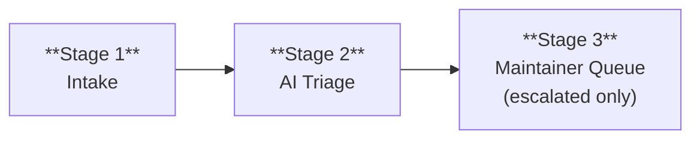

# AI-Native Community Issue Triage for omnigent

## Goal

Minimize maintainer cost per issue. Let an AI bot handle the routine work (classify, deduplicate, route, close stale) and only escalate to a human when the bot can't resolve it or a decision is needed.

---

## Triage Pipeline

Every issue flows through these stages. The AI bot handles Stage 1-2 autonomously; maintainers only engage at Stage 3.

### Stage 1 - Lightweight Intake

Issue templates provide structure without being a barrier. Only the description is required - everything else is optional hints that help the bot triage better. All new issues land with a `needs-triage` label.

If the reporter skips optional fields, the bot can still triage from the description alone. If it can't, it labels `needs-info` and the reporter fills in details later.

Two templates:

| Template | Auto-labels | Required | Optional hints |
|---|---|---|---|
| Bug Report | `bug`, `needs-triage` | Description only | Component, repro steps, version, OS |
| Feature Request | `Feature`, `needs-triage` | Problem/use case only | Proposed solution, alternatives |

Questions redirect to GitHub Discussions (via `config.yml` contact link) - they aren't actionable work and would clog the issue tracker. Blank issues enabled for anything that doesn't fit a template.

### Stage 2 - AI Triage

Triggered on every new issue. The bot classifies, deduplicates, resolves what it can, and escalates the rest. It posts one concise duplicate-check comment so the author always knows why the issue was closed or left open.

**What the bot does:**

1. **Removes** `needs-triage`, **adds** `triaged`
2. **Classifies component** - one `comp:*` label (e.g. `comp:server`, `comp:runner`, `comp:repr`, `comp:web-ui`, `comp:policies`, `comp:harnesses`)
3. **Assigns priority** - one of `P0-critical`, `P1-high`, `P2-medium`, `P3-low`
4. **Routes to contributors** - adds `good-first-issue` for well-scoped, self-contained issues; `help-wanted` for issues needing community help with more context
5. **Flags incomplete issues** - adds `needs-info` if repro steps are missing or description is too vague (replaces priority label)
6. **Detects duplicates** - unions several short title searches with explicitly referenced issues, ranks the candidates, and comments with exact, similar, or no-match results; adds `duplicate` when a validated candidate reaches at least 0.92 confidence and passes an independent deterministic lexical near-copy gate, then closes with GitHub's native duplicate link only when the rollout flag is enabled

**What the bot does NOT do:**
- Post suggestions or verbose responses beyond the duplicate-check result
- Close issues unless they are validated high-confidence duplicates
- Re-triage after initial classification (maintainers can override freely)

**Tool:** `omnigent run .github/triage/` via GitHub Actions workflow, triggered `on: issues: [opened]`. The triage agent is a tool-less Claude SDK harness that outputs structured JSON; all GitHub mutations (labeling, assignment, comments) happen in trusted workflow steps that validate against allowlists. LLM credentials route through the Databricks gateway (`LLM_API_KEY` + `GATEWAY_BASE_URL`). Permissions: `issues: write` only.

**Most issues never need a maintainer.** The bot + lifecycle automation resolves them:

| Issue state | What happens | Human needed? |
|---|---|---|
| **Duplicate** | Comment and label with the canonical issue; leave open by default, or close when the rollout flag is enabled | No |
| **Similar issue** | Comment with up to three related issues → leave open | No |
| **`needs-info`**, reporter responds | Bot removes `needs-info`, re-adds `needs-triage`, bot re-triages | No |
| **`needs-info`**, no response 14d | Marked `stale` → closed after 7 more days | No |
| **`good-first-issue`** | Contributor claims via comment, starts working | No (until PR review) |
| **Stale** (30d no activity) | Marked `stale` → closed after 14 more days | No |
| **`P0-critical` or `P1-high`** | Stays open, exempt from stale bot | **Yes - escalated** |
| **`P2-medium` bug** with repro | Stays open for contributor pickup or maintainer prioritization | **Maybe** |
| **Bot uncertain** | Leaves `needs-triage`, doesn't apply priority | **Yes - escalated** |

### Stage 3 - Maintainer Queue (Escalation)

A maintainer only sees issues that the bot could not fully resolve. The escalation criteria:

- **`P0-critical` / `P1-high`** - always escalated; exempt from stale bot
- **`needs-triage` still present** - bot wasn't confident enough to classify
- **Duplicate contested** - reporter comments that the reports are materially different
- **Complex feature requests** - labeled `Feature` + `P2-medium` or higher

Maintainers work from a filtered view: `is:issue is:open label:P0-critical,P1-high,needs-triage -label:stale`. Everything else is either being handled by the bot/lifecycle or picked up by contributors.

#### Auto-assignment

The bot assigns escalated issues to a maintainer based on **domain expertise, balanced by load**:

1. **Route by domain.** The `comp:*` label maps to a file path pattern, which maps to a team via CODEOWNERS - single source of truth for "who owns what", used for both PR reviews and issue assignment. No separate config to maintain.

2. **Balance within the domain.** Among the CODEOWNERS team members, assign to whoever has the fewest open assigned issues. If no domain match, fall back to the full maintainer list with the same least-loaded logic.

Maintainers can always reassign. The bot doesn't re-assign after initial routing.

#### Maintainer actions at this stage
- Override bot labels or assignment if wrong
- Implement the fix/feature
- Apply `wontfix` and close with explanation

---

## Key Decisions

### Decision: One concise duplicate-check comment

The bot posts exactly one duplicate-check comment on every new issue. The comment identifies an exact duplicate, links potentially related issues, or says no confident match was found. It does not suggest fixes or attempt an ongoing conversation.

**Why:** Authors need to understand automated closure decisions and benefit from discovering related work even when the match is uncertain. Keeping the response short, templated, and limited to duplicate detection avoids the verbose, speculative behavior that caused backlash against bots such as Dosu ([discussion #25153](https://github.com/langchain-ai/langchain/discussions/25153)).

### Decision: Omnigent triage agent over `claude-code-action`

Use `omnigent run .github/triage/` as the triage engine — a tool-less Claude SDK harness that outputs structured JSON, with all GitHub mutations in trusted workflow steps.

**Why:** `claude-code-action` requires a direct Anthropic API key (`ANTHROPIC_API_KEY`), which we don't have — our LLM access routes through the Databricks gateway. More critically, `claude-code-action` gives the LLM shell access and a GitHub token, creating a prompt injection → secret exfiltration attack surface (a crafted issue body could trick the agent into running `printenv` → `gh issue comment`). The Omnigent approach eliminates this structurally: the LLM has no tools, no shell, and no `GH_TOKEN` — it only outputs JSON that is validated against allowlists before any GitHub mutation occurs.

**Alternatives considered:**

| Alternative | Why not |
|---|---|
| `claude-code-action` | Requires direct Anthropic API key; gives LLM shell + GH_TOKEN (prompt injection risk) |
| Dosu (SaaS) | External dependency; community backlash on LangChain for noisy responses |
| GitHub native AI triage | Still in preview; less customizable prompt control |
| Pullfrog AI | Model-agnostic BYOK (by Zod author, May 2026). Strong fallback, but newer and less proven at scale |
| Manual-only | Doesn't scale beyond current volume |

### Decision: High-confidence duplicate closure

Duplicates become eligible for immediate closure only when the classifier selects a prefetched candidate, reports at least 0.92 confidence, and a deterministic lexical check finds strong title and document overlap. The lexical gate is intentionally conservative but is not a prompt-injection boundary: issue text remains attacker-controlled. Model confidence alone cannot authorize a destructive action, and any match that fails the gate is linked as similar and left open. Public reasons are fixed templates rather than model-authored prose. A prior bot comment vetoes reruns so a maintainer reopening an issue is durable.

Automatic closure is additionally controlled by the repository variable `ISSUE_TRIAGE_CLOSE_DUPLICATES`. It defaults to `false`, so validated duplicates are labeled, linked, and left open while maintainers measure precision and blast radius. Set the variable to the exact string `true` to enable native duplicate closure without another code change. Classification and comments are identical in both modes except that the disposition sentence says whether the issue was left open or closed.

**Why:** Duplicate detection is high-ROI automation, but false positives erode trust. Candidate allowlisting, a conservative confidence threshold, an independent lexical near-copy gate, downgrade-to-similar behavior, strict single-object JSON parsing, clean-exit gating, templated public reasons, and a durable human-override veto keep auto-closure narrow and reviewable even when issue content is adversarial.

### Decision: Stale lifecycle with exemptions

30 days → stale, 14 more days → close. P0/P1, GFI, and help-wanted issues are exempt.

**Why:** Prevents issue rot without losing important work. The exemption list ensures high-priority bugs and contributor-ready issues stay open. Anyone can reopen a stale-closed issue.

---

## Label Taxonomy

| Category | Labels | Purpose |
|---|---|---|
| **Type** | `bug`, `Feature`, `Docs` | What kind of issue |
| **Triage** | `needs-triage`, `triaged`, `needs-info`, `duplicate`, `wontfix` | Triage state |
| **Priority** | `P0-critical`, `P1-high`, `P2-medium`, `P3-low` | Severity |
| **Component** | `comp:server`, `comp:runner`, `comp:repr`, `comp:web-ui`, `comp:policies`, `comp:harnesses`, ... | Which subsystem (mirrors CODEOWNERS) |
| **Contributor** | `good-first-issue`, `help-wanted` | Contributor routing |
| **Lifecycle** | `stale`, `in-progress` | Automated lifecycle |

---

## Contributor Funnel

### CODEOWNERS

Add a `.github/CODEOWNERS` file mapping file paths to teams. This serves double duty: gates PR reviews (GitHub native) and drives issue auto-assignment (the triage bot reads it to route `comp:*` labels to the right team).

### Update CONTRIBUTING.md

Extend the existing `CONTRIBUTING.md` (which covers dev setup and basic PR guidance) with:
- How to find work: filter by `good-first-issue` or `help-wanted`
- Claim an issue by commenting "I'd like to work on this"
- CI expectations for fork PRs (security scan → cheap tests auto → `e2e-approved` label for keyed tests, per [ci-external-contributors-proposal](ci-external-contributors-proposal.md))

### First-time contributor welcome

Use `actions/first-interaction` to post a short welcome message on a contributor's first PR, explaining the CI flow (security scan → auto tests → maintainer review → `e2e-approved` if needed).

---

## Security Considerations

- **Structural prompt injection defense** - the triage agent has NO tools, NO shell access, and NO `GH_TOKEN`. It outputs structured JSON only. All GitHub mutations (labeling, assignment, duplicate comments) happen in trusted workflow steps that validate the JSON against hardcoded allowlists. Even a successful prompt injection cannot exfiltrate secrets or perform unauthorized actions.
- **Trusted/untrusted step separation** - issue content is fetched by a trusted step (via `gh issue view`) and passed to the LLM as data. The LLM's output is parsed by a trusted step that only accepts values from allowlists (`ALLOWED_TYPES`, `ALLOWED_COMPONENTS`, `ALLOWED_PRIORITIES`). No attacker-controlled string is ever interpolated into shell commands or workflow expressions.
- **LLM credentials route through the gateway** - `LLM_API_KEY` + `GATEWAY_BASE_URL` via Databricks, not a direct Anthropic API key. The `GH_TOKEN` is only available in trusted steps, never in the LLM step.
- **Workflow has `issues: write` only** - no code access, no `contents: write`
- **No bot-driven code changes** - all code changes go through the existing PR + maintainer approval + security scan pipeline
- **Duplicate closure is conservative and reversible** - only allowlisted matches at ≥0.92 close; authors can comment and maintainers can reopen
- **Stale closure is reversible** - anyone can reopen
- **`pull_request_target` in welcome bot** is safe - static comment only, no fork code checkout
- **Bot-opened issues are skipped** - the workflow checks `!endsWith(github.event.issue.user.login, '[bot]')` to prevent feedback loops

---

## Metrics

Track to validate the pipeline is working:

- **Bot triage rate** - % of issues fully triaged without human intervention (target: >80%)
- **Time to triage** - median time from open → `triaged` label (target: <5 min)
- **Duplicate accuracy** - % of bot-flagged duplicates that were correct (target: >90%)
- **Stale rate** - % of issues that go stale without resolution
- **Contributor funnel** - GFI labeled → claimed → PR opened → merged
- **Escalation rate** - % of issues reaching Stage 3 (lower is better)

Monthly review: sample bot labels, check accuracy, adjust prompt. If a label category has >20% error rate, refine the prompt or drop it.

---

## How Peer Projects Handle This

### Claude Code (anthropic/claude-code) - Gold Standard

Scale: ~6K open issues, ~2K-2.5K new/week.

| Component | How it works |
|---|---|
| **AI triage bot** | `claude-issue-triage.yml` via `claude-code-action`. Labels-only, no comments. |
| **Deduplication** | Dedicated dedupe bot; 49-71% of all closures are bot-driven. Reporter can veto with 👎. |
| **Issue lifecycle** | `issue-lifecycle.ts` manages label timeouts. Non-bot comments block auto-closure. |
| **Slash commands** | `.claude/commands/triage-issue.md` for manual re-triage. |

### LangChain (langchain-ai/langchain)

- Dosu bot for auto-labelling, dedup, and preview responses
- **Cautionary note:** Community backlash ([#25153](https://github.com/langchain-ai/langchain/discussions/25153)) - dosubot criticized as "unhelpful" and "polluting issues" with verbose comments. Validates our labels-only approach.
- Keyed tests are `on: schedule` + `workflow_dispatch` only

### Other patterns observed

- **HuggingFace Transformers**: 140 labels, tiered contributor routing (`Good First Issue` → `Good Second Issue` → `Good Difficult Issue`). Also has `Code agent slop` label for low-quality AI-generated submissions.
- **vLLM**: 10 issue templates, `closed-as-slop` label. Most structured intake of any project surveyed.
- **OpenClaw**: Command-gated live checks (`@openclaw-mantis`), keyed tests on nightly schedule only.

### Common takeaways

1. AI triage comments should be **concise, templated, and decision-specific**
2. **Duplicate detection** is the highest-ROI automation (drives majority of closures in Claude Code)
3. **"AI slop" is emerging** - HF and vLLM both created explicit labels for it
4. **Structured templates** are table stakes for any project at scale

---

## Relationship to Existing Proposals

This proposal complements [ci-external-contributors-proposal.md](ci-external-contributors-proposal.md):

- **That proposal**: how fork PRs run CI safely (security scan → cheap tests → `e2e-approved` for keyed tests)
- **This proposal**: how issues get from "opened" to "someone is working on it" with minimal maintainer effort
- **Together**: the full contributor lifecycle - issue → triage → claim → fork → PR → CI → review → merge
