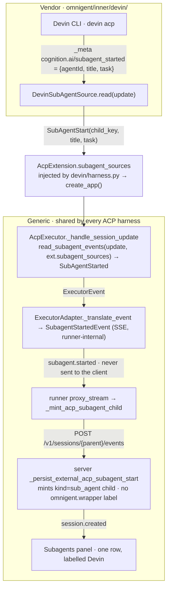
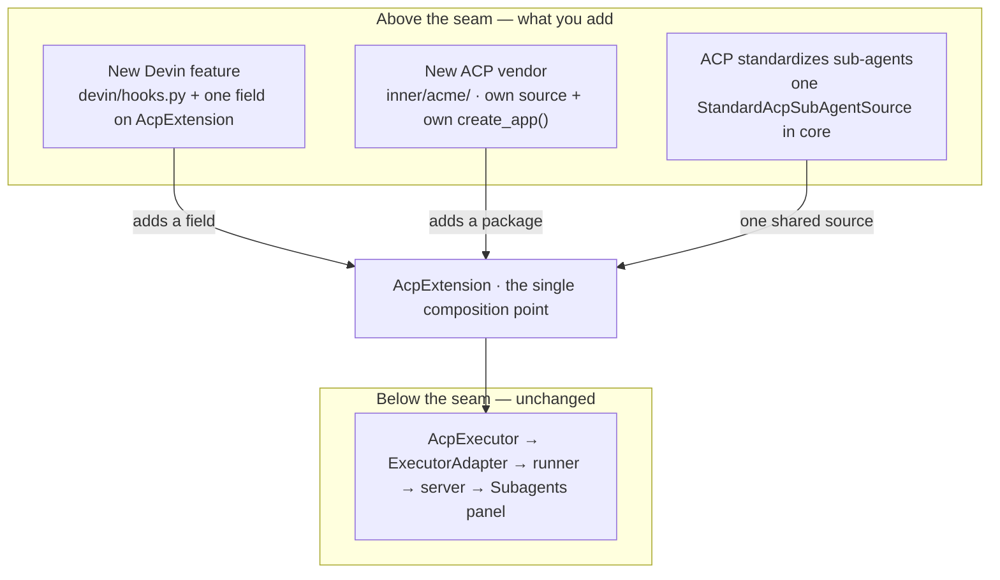

# Devin (`acp:devin`) — architecture, state of the world, and follow-ups

Devin (Cognition's `devin acp`) runs through Omnigent's **generic ACP harness** —
no bespoke transport, no fork of the executor six other agents share. What makes
it more than a config row is one small, self-contained vendor layer that plugs in
above a seam; everything below the seam is the generic ACP pipeline.

This document is three things:

1. **[State of the world](#state-of-the-world)** — what Devin supports on `main`
   today, and where it is still behind the native harnesses.
2. **[Architecture](#architecture-the-acp-extension-seam)** — the `AcpExtension`
   seam and how a sub-agent becomes a panel row, with the design choices behind it.
3. **[Follow-ups](#follow-ups)** — the roadmap, with the open PRs that carry it.

> Current as of 2026-08-26. Grounded in `harness_capabilities()` on `main`, the
> harness bench (`tests/harness_bench`), and live `devin acp` probes (Devin Pro,
> v3000.x). Devin authenticates itself (`devin auth login`); Omnigent stores no
> Devin credential.

---

## State of the world

Devin rides the generic executor (`omnigent/inner/acp_executor.py`), so it starts
with everything that path already does and adds a Devin-specific sub-agent layer.
The table is Devin-centric: **✓** works on `main`, **~** partial/caveated, **✗**
absent. Where a gap has a tracking PR it is named; those are expanded under
[Follow-ups](#follow-ups).

| Capability | State | Mechanism / caveat |
|---|:---:|---|
| Integration | ✓ | ACP subprocess (`devin acp`) over JSON-RPC/stdio; generic executor |
| Auth | ✓ | Devin's own (`devin auth login`); Omnigent stores no credential |
| Model family | ✓ | Multi — SWE / Claude / Gemini / GPT; effort is encoded in the model id |
| Model switch mid-session | ✓ | Warm, via `session/set_config_option` (#4703) — no respawn |
| Setup + picker | ✓ | Builtin `devin` row; catalog-derived identity (#4909, #4920); a configured `acp:` agent of the same name wins (#4927) |
| Omnigent MCP relay | ✓ | stdio; 26 builtin tools bridged via `session/new.mcpServers` |
| Streaming / reasoning / tool cards | ✓ | `agent_message_chunk` / `agent_thought_chunk` / `tool_call` |
| Images · cost/usage · interrupt | ✓ | image blocks · `result.usage` · `session/cancel` |
| Tool-call identity in the approval card | ✓ | Card names the tool + command, not `"tool"` / `{}` (#5050) |
| Policy DENY on shell | ✓ | `session/request_permission` → TOOL_CALL policy; the command is now visible to rules (#5050) |
| Elicitation / ASK | ✓ | sse-permission; the agent's **own** scopes render on the card (#5053) |
| Headless / unattended | ✓ | `permission_mode: bypassPermissions` runs without parking on a card (#5056) |
| **Sub-agents surface in the UI** | ✓ | Devin's parallel sub-agents appear as child sessions, labelled "Devin" (#5489) |
| Sub-agent transcript depth | ✓ | Child chat shows the sub-agent's nested tool calls, routed via `cognition.ai/subagent_context` (#5575), and they persist across reload (#5583) |
| Policy on edits / MCP tools | ~ | Shell is gated; file edits (under *accept-edits*) and the agent's own MCP tools are not — #4707 |
| Shell **execution** | ~ | Devin executes its shell; Omnigent gates but does not run it (no terminal takeover) — #4701 |
| Cost / token budget | ~ | `cachedReadTokens` dropped; no budget primitive — #4704 |
| Compaction | ~ | Devin compacts internally and surfaces no progress |
| Warm resume | ✗ | Cold text-replay only; `session/load` not implemented — #4705 |
| Fork history | ✗ | No fork; no PR yet |
| Steering (mid-turn) / live queue | ✗ | ACP has no mid-turn message path — interrupt + re-prompt only |
| Un-lent MCP detection | ✗ | Devin can load its own MCP servers, bypassing policy — #4706 |
| Sub-agent write to the task dir | ✗ | **Devin's own isolation model**, not a seam gap: sub-agents run under a different env root than the task dir — [detail](#sub-agent-sandbox-root) |

**Where Devin is ahead of the native harnesses:** it is genuinely multi-model
(vs Claude- or GPT-locked natives), and it supports ASK-capable elicitation (vs
pi-native's deny-only). The **~/✗** rows above are the places native harnesses
still lead — and they are the roadmap.

---

## Architecture: the ACP extension seam

The whole design turns on one boundary. **Above the seam** is the only code that
knows the word "Devin". **Below the seam** is the generic ACP pipeline that Grok,
kilocode, Qwen, and every BYO `acp:<slug>` agent already share.

### The mental model

```
AcpSubAgentSource   (Protocol, generic)        omnigent/inner/acp_subagents.py
   read(update) -> Sequence[SubAgentStart | SubAgentEnd]
        ▲ implements
DevinSubAgentSource                            omnigent/inner/devin/subagents.py   ← vendor
        │ held by
AcpExtension(name, subagent_sources=(...))     omnigent/inner/acp_extension.py     ← the seam
   NO_ACP_EXTENSION    = ("acp",   ())         ← generic default: reads no vendor field
   DEVIN_ACP_EXTENSION = ("devin", (DevinSubAgentSource(),))   omnigent/inner/devin/__init__.py
        │ injected via  create_app(extension=...)
AcpExecutor(config, *, extension=NO_ACP_EXTENSION)   omnigent/inner/acp_executor.py  ← generic
   consumes ext.subagent_sources — no vendor name anywhere
```

The seam is **composed at the harness boundary, not discovered**: Devin's own
`create_app()` hands its extension to the shared ACP wrap. There is no registry to
consult and no `if harness == "devin"` in the generic path. The generic `acp`
harness runs with `NO_ACP_EXTENSION` and behaves exactly as it did before Devin
existed.

### How a sub-agent becomes a panel row

Devin delegates to parallel sub-agents and reports each in its own vendor dialect
— vendor `_meta` keys, not any ACP-standard field. Here is the full path of one
`subagent_started` frame; only the two vendor boxes at the top know "Devin".



The completion edge (`cognition.ai/subagent_completed`) travels the same path and
records the sub-agent's summary + status on the child.

### Key code

The seam — `omnigent/inner/acp_extension.py`:

```python
@dataclass(frozen=True)
class AcpExtension:
    name: str
    subagent_sources: tuple[AcpSubAgentSource, ...] = ()

    @property
    def surfaces_subagents(self) -> bool:      # capability, derived — never hand-set
        return bool(self.subagent_sources)

NO_ACP_EXTENSION = AcpExtension(name="acp")     # the generic default; reads no vendor field
```

Devin plugs in — `omnigent/inner/devin/`:

```python
# subagents.py — the ~30 lines that are genuinely Devin's
class DevinSubAgentSource:
    def read(self, update):                     # self-gates on cognition.ai/*
        meta = update.get("_meta") or {}
        started = meta.get("cognition.ai/subagent_started")
        # ... → SubAgentStart(child_key=agentId, title=..., task=...)

# __init__.py — the composition root
DEVIN_ACP_EXTENSION = AcpExtension(name="devin", subagent_sources=(DevinSubAgentSource(),))

# harness.py — the whole wrap; harness_modules["devin"] resolves here
def create_app():
    return acp_harness.create_app(extension=DEVIN_ACP_EXTENSION)
```

The generic executor consumes it with no vendor name in sight —
`omnigent/inner/acp_executor.py`:

```python
for sub in read_subagent_events(update, self._extension.subagent_sources):
    events.append(SubAgentStarted(...) if isinstance(sub, SubAgentStart)
                  else SubAgentCompleted(...))
```

---

## Design choices

The decisions that shaped this, and the trade-off each one accepts.

### Stay generic; compose, don't fork

Devin rides the generic executor because **almost everything it needs is standard
ACP, not a Devin extension** — `session/set_config_option` (model switch),
`session/load` (resume), `terminal/*` (shell mediation), `fs/*`, `usage`. Only the
sub-agent dialect and the (future) hook flavour are vendor-shaped. Forking the
executor would fork the code path six agents share to gain almost nothing.

The **escape valve** is real but narrow: split Devin into its own harness only if
a non-ACP transport becomes necessary (e.g. driving cloud sessions through
`api.devin.ai`), if vendor `_meta` handling outgrows a couple of capability-gated
branches, or if a quirk cannot be expressed as data. The smell test: no branch
anywhere keys off the agent's *name*. "Does this agent advertise `loadSession`?"
is the right shape; "is this agent Devin?" is the wrong one.

### The seam is a dataclass injected at the harness boundary

`AcpExtension` is a value the vendor's `create_app()` passes in — not something the
executor looks up. This keeps the executor protocol-pure and makes the three kinds
of future change (below) all attach at one point. **Trade-off:** composition's
failure mode is silent — a Devin process that quietly behaves as a plain ACP one —
so the injection is pinned by a test (`test_devin_harness`).

### Read vendor `_meta`, because no ACP-standard sub-agent signal exists yet

ACP has not standardized sub-agents. The emerging RFD proposes a `tool_call` with
`kind: "subagent"` plus a `childSessionId` and a separate child session — but no
shipping agent emits it. Measured against a live delegating turn, Devin emits
**none** of that, and none of the Claude-Code `_meta` convention
(`subagent-transcript` opt-in, `parentToolUseId`) either. Its only structured
signal is `cognition.ai/subagent_*`. So a strictly-generic reader would compile,
be future-proof, and **surface nothing for Devin today**. The dialect is therefore
read — but quarantined in `DevinSubAgentSource`, which self-gates on the vendor
keys and is inert for every other agent. When ACP standardizes, one shared source
keyed on the standard fields covers every compliant agent at once, and can live in
core rather than per-vendor.

### The child carries no wrapper label — so it inherits the parent's identity

A first cut minted the child through the claude-native path, which stamps
`omnigent.wrapper = claude-code-native-ui-subagent`. The UI resolves a child's
displayed harness from that label **first**, so a Devin sub-agent rendered as
"Claude Code". The ACP mint (`_persist_external_acp_subagent_start`) sets **no**
wrapper value; the child's harness then resolves through `_resolve_harness_impl` to
the parent's (`devin`) and the UI labels it from the catalog. The *absence* of the
label is load-bearing, and an integration test asserts it.

### The transcript is real conversation items — and the summary needs an author

The child chat is seeded over the existing `external_conversation_item` bridge: the
delegated task as a **user** message on the start edge, the sub-agent's summary as
an **assistant** message on completion. `MessageData` rejects an assistant message
with no `agent`, so the summary must carry the sub-agent's title as its author — an
earlier version omitted it, the server 400'd, the runner swallowed the failure, and
the summary silently never appeared. Both posts are best-effort: a transcript hiccup
still leaves a working row, because the panel entry is what matters.

### Tool identity is recovered from the tool_call cache

Devin's `session/request_permission` carries only a `toolCallId` — no title, kind,
or args. The originating `tool_call` (with the title and command) always arrives
first and is already cached, so the approval card and the TOOL_CALL policy both see
the real name and command instead of `"tool"` / `{}`. This is what lets a
"deny `rm -rf`" rule actually fire on a Devin shell command (#5050).

### `permission_mode`: only `bypassPermissions` waives the card

Matching claude-sdk's gate: `bypassPermissions` skips the human approval card for a
call **no policy had an opinion on**; `auto` (the default) still prompts, and an
unrecognized value prompts. Policy runs in every mode — a DENY still blocks, an
explicit ASK still prompts — so bypass waives the *human* gate, never the user's
rules. Bypass answers each request individually and never selects Devin's own
`switch_bypass` option, which would end the request stream and take the agent's
tool calls out of policy's view (#5056).

### The sub-agent SSE events are runner-internal

`subagent.started` / `subagent.completed` are runner↔server plumbing (modeled on
`policy_evaluation.requested`) and are **never relayed to external clients** — the
client learns of the child through the ordinary `session.created` event. The server
side reuses the existing external-subagent machinery, so this added one event type
and one persist helper, not new protocol.

### Everything is additive and capability-gated

The hard constraint: never regress an existing ACP agent (Goose, kilocode, Qwen,
Grok, BYO `acp:`). The generic default reads no vendor field; a new behaviour
probes for a capability or reads the extension, and falls back to today's path when
absent. The generic sub-agent tests use invented dialects and one asserts the
default executor does **no** scanning at all — so Grok and `acp:*` agents never pay
for Devin's `_meta` scan.

---

## How it extends

Three kinds of change are coming, and they are the same shape: something attaches
*above* the seam. Two are vendor-side; one is core-side. None touch the pipeline
below.



- **A new Devin capability** (policy hooks, steering) is a sibling module in
  `omnigent/inner/devin/` plus **one new field** on `AcpExtension` that the executor
  reads at one more place. This is why the seam is a dataclass, not a bool — it has
  room to carry a `tool_gate`, an `initialize`-capabilities contribution (the opt-in
  the Claude-Code `subagent-transcript` convention needs), and so on.
- **A new ACP vendor** is its own package with its own `create_app()` injecting its
  own `AcpExtension`. It never touches Devin's code or the generic path — vendors
  compose side by side.
- **ACP standardizing sub-agents** collapses the per-vendor sources into a single
  `StandardAcpSubAgentSource` in core, keyed on `kind: "subagent"` + `childSessionId`
  — one source, every compliant agent.

### Lifting Devin out later

The package is deliberately shaped like a community harness plugin — a folder of
vendor code plus a `create_app()`, the same layout as
[`omnigent-rovo`](https://omnigent.ai/docs/build/harnesses/community) and the
[Harness Plugin Interface](../designs/harness-plugin-interface.md). Moving Devin to
its own repo is a **move, not a rewrite**: relocate the folder, add an
`omnigent.community.harness` entry point, and delete the builtin catalog row (a
plugin may not override a builtin harness name). The one dependency it keeps is the
shared surface — `Executor`, `ExecutorAdapter`, `AcpExtension` — which is exactly
the plugin contract, and which `test_devin_liftability` enforces so the code cannot
quietly grow a dependency that would make the move a rewrite.

---

## What keeps the seam honest

Both properties — "vendor code stays above the seam" and "the generic path names no
vendor" — erode with one convenient import, so they are asserted mechanically:

| Guard | What it holds |
|---|---|
| `test_devin_liftability` | Devin imports only the liftable surface, and no generic ACP module imports a vendor. Verified to fail on a real violation. |
| `test_devin_harness` | Pins the injection — a wrap that forgot to pass its extension would silently run as plain ACP. |
| `surfaces_subagents` | The `subagents` capability on `/v1/harnesses` is derived from the extension, so the published matrix can't drift from the code. |
| vendor-free generic tests | The generic sub-agent suite names no vendor and asserts the default executor does no scanning. |

---

## Follow-ups

The roadmap, roughly in priority order. Each is additive and capability-gated per
the constraint above. Items with an open PR are named; the rest have no PR yet. A
couple have shipped since this doc first landed — kept below, marked, as history.

### Tool mediation — run the shell in Omnigent (#4701, open)

Today Omnigent *gates* Devin's shell (the command is visible to policy since #5050)
but Devin *executes* it. Advertising the ACP `terminal/*` client capability makes
Devin delegate execution back to Omnigent, so the sandbox, audit trail, and policy
verdict cannot be bypassed by the agent's own mode — and the user can take the
terminal over. Verified end-to-end against real `devin acp` (ALLOW ran in Omnigent;
DENY blocked). Gated on the capability, so agents that ignore it are unaffected.

### Gate edits and MCP tools via PreToolUse hooks (#4707, open)

Shell is gated; file edits under *accept-edits* and the agent's own MCP tools are
not. Devin supports Claude-Code-style `PreToolUse` hooks that fire in ACP mode and
can block or rewrite a call (verified). The bridge mirrors `claude_native_hook.py`.
The generic shape is a `tool_hooks: claude-code | none` **flavour** on the agent
record — any Claude-Code-compatible agent benefits, keyed off the format, not the
name.

### Warm resume via `session/load` (#4705, open)

Devin advertises `loadSession: true`, but the executor replays the transcript as
text (cold). Implementing `session/load`, gated on `agentCapabilities.loadSession`,
lifts warm resume for the whole ACP family; agents without it keep the text-prefix
fallback.

### Detect un-lent MCP servers (#4706, open)

Any ACP agent can load MCP servers Omnigent never lent, bypassing policy. Devin
announces them (`_cognition.ai/mcp/serversChanged`); parsing that turns an invisible
hole into a visible warning for the whole ACP family. (Note: the PreToolUse bridge
above can *gate* those tools via `^mcp__.*` even though it can't stop them loading.)

### Token-budget cost policy (#4704, open)

Two accuracy fixes first: `cachedReadTokens` is dropped (in one measured turn,
10,944 of 15,637 input tokens were cache reads — ignoring them overstates cost ~3×),
and `usage_update.used` is ignored. Then a `RESPONSE`-phase budget primitive.
Advisory, not a hard cap — ACP agents self-report usage. Tokens only; dollars need a
per-harness price table that goes stale.

### Sub-agent transcript depth

**Shipped in #5575 (routing) and #5583 (persistence).** Was: the child chat showed
only the task + summary, not the nested tool calls the sub-agent ran. Devin tags those
frames with `cognition.ai/subagent_context` (carrying the owning `parentAgentId`);
#5575 reads them and routes each into the child transcript as its own tool card, and
#5583 gives those observed cards a durable `completed` re-emission so they survive a
reload. Kept here as history — no longer open.

### Sub-agent sandbox root

**Devin's own isolation model, not an Omnigent seam gap.** Observed while capturing
frames: Devin's sub-agents run under a different env root than the task directory
(e.g. `tmp.tmvzH5OXHu` vs the task's `tmp.nAW8FoCJcT`), so a sub-agent's `write` to
the task dir is denied and Devin falls back to writing files itself via `exec`. The
sub-agent's `request_scope` can't cross into the parent task's root — that is Devin's
sandbox architecture, not something the `AcpExtension` seam can or should fix from
Omnigent's side. There is no Omnigent PR because there is no Omnigent-side gap; if it
ever needs addressing it belongs upstream in Devin (or a future ACP scope-negotiation
primitive).

### No PR yet — deeper protocol gaps

- **Fork history** — no ACP mechanism; native harnesses rebuild from history.
- **Steering (mid-turn) / live queue** — ACP has no mid-turn message path, so
  Omnigent can interrupt and re-prompt but not inject into a running turn.
- **Compaction progress** — Devin compacts internally and surfaces no
  `CompactionComplete`, so long sessions show no compaction indicator.
- **Headless silent-stall** — a permission request in `-p` mode with no card to
  answer it produces no output; `permission_mode: bypassPermissions` (#5056) is the
  workaround, but the stall itself is unfiled.
