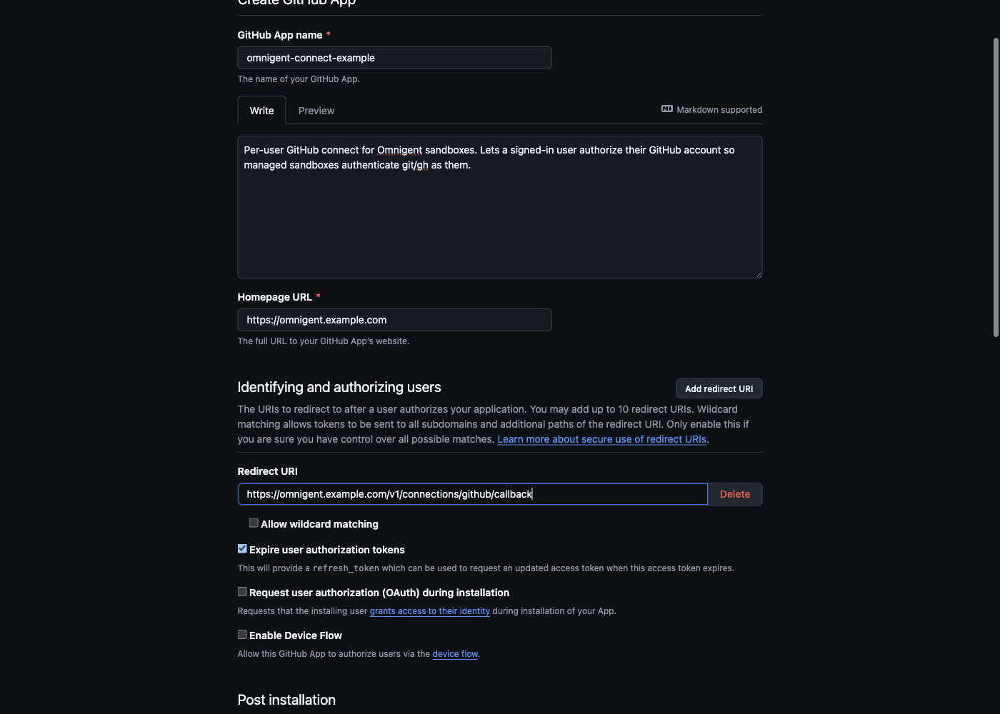
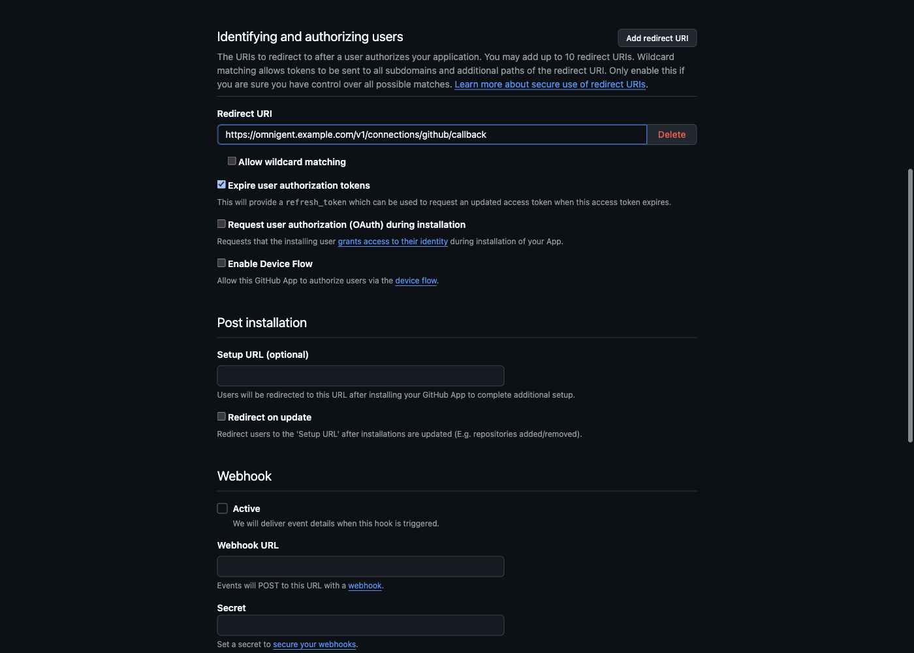
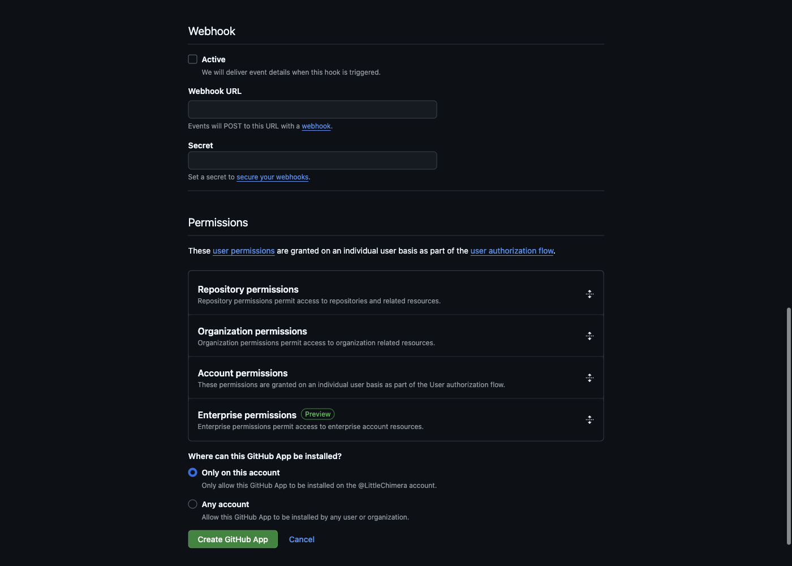
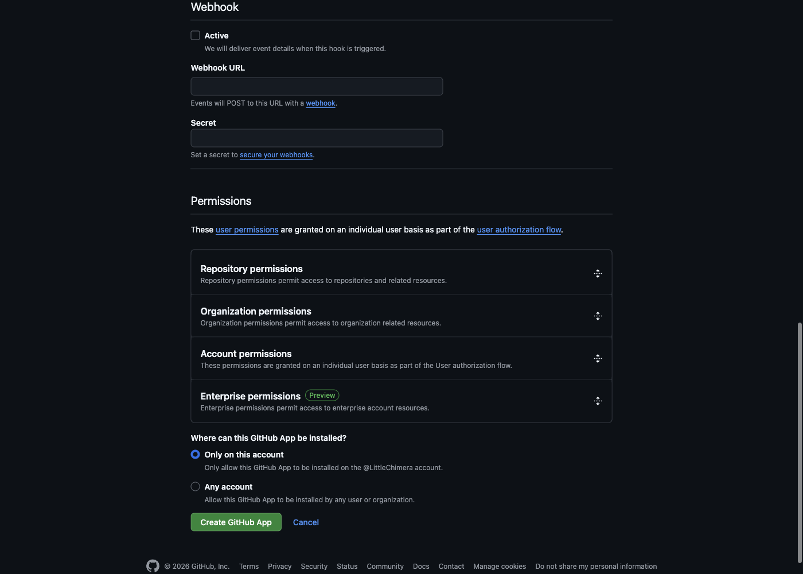
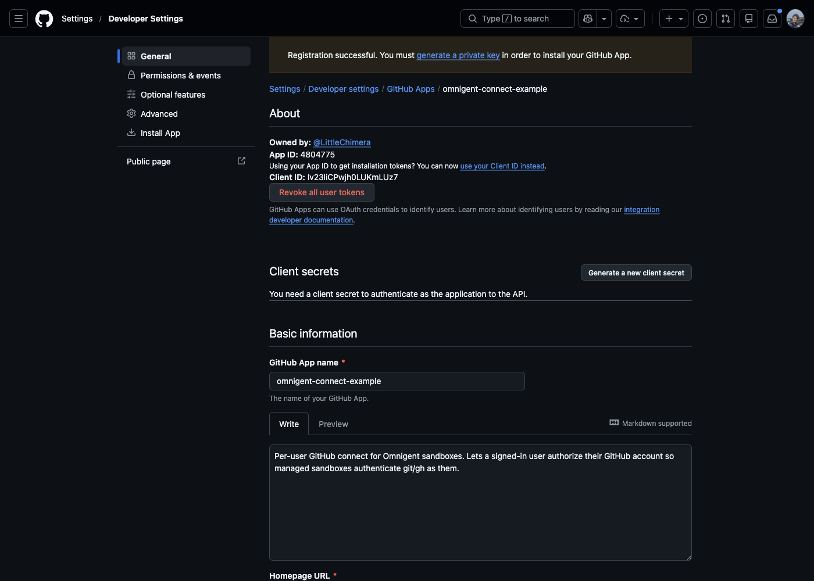
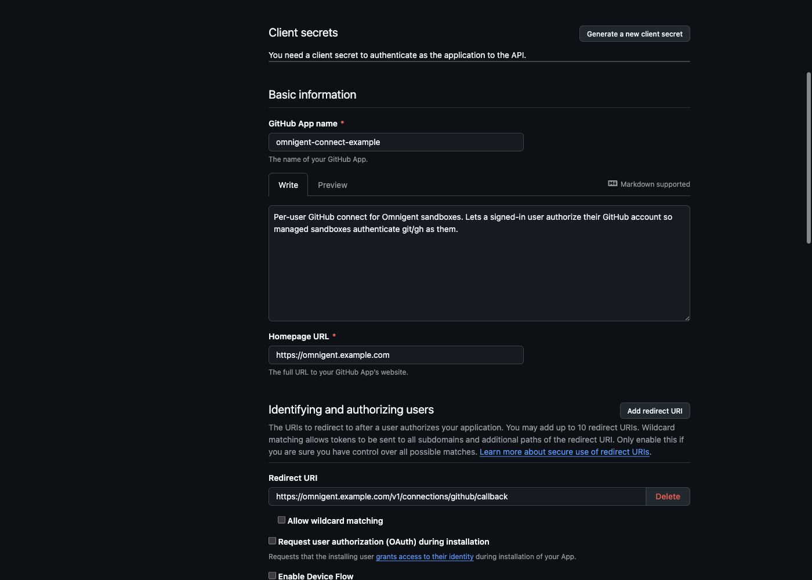
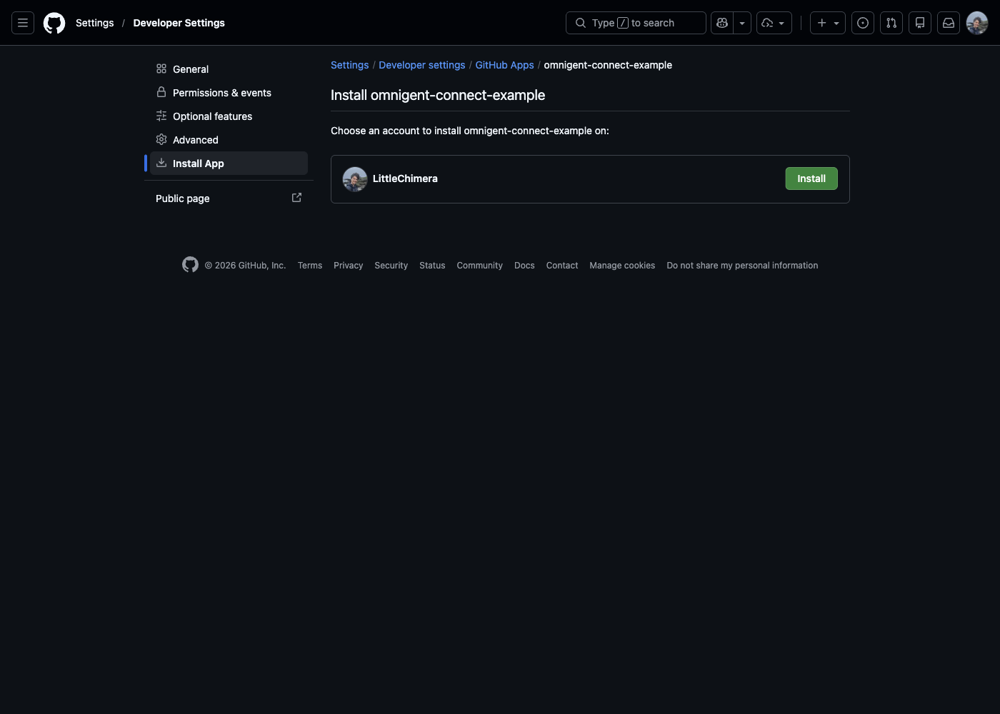

# GitHub App setup (per-user GitHub connect)

How to register and wire the **GitHub App** that powers Omnigent's per-user
GitHub connect. Once configured, a signed-in user can **Settings → Sandbox
Integrations → Connect GitHub**, and their managed sandboxes then authenticate
`git` / `gh` as them (clone private repos, push branches, open PRs) using a
short-lived token minted from that user's authorization — never a shared PAT.

> **Screenshots** are from GitHub's **Settings → Developer settings → GitHub
> Apps** flow, walked with the example values below. The App ID / Client ID
> shown are non-secret identifiers from a throwaway example app; the client
> secret and private key are never captured.

---

## How it works (why a GitHub App at all)

- **Connect (user OAuth).** `GET /v1/connections/github/connect` signs a
  short-lived, user-bound `state` (JWT) and redirects the user to GitHub's
  authorize screen. GitHub redirects back to
  `…/v1/connections/github/callback`, which exchanges the `code` for a
  **user-to-server** access token (+ refresh token) and stores it encrypted
  (KMS) in the credential store. The `state` is signed with a subkey derived
  from the App's client secret, and the callback rebinds `state.sub` to the
  authenticated caller so it can't be replayed or cross-bound.
- **Use (in the sandbox).** On sandbox launch the server vends that user's
  fresh token to the runner, which materializes git/gh credentials. A refresh
  token keeps long sessions authenticated.
- **App, not OAuth App or PAT.** A GitHub App is an org-ownable, least-privilege
  identity whose **per-repo content access requires the App to be installed** on
  the account/org that owns the repo — so access is auditable and revocable per
  install, and there is no long-lived personal secret to leak.

> **The one gotcha:** user OAuth alone lets Omnigent *list* the repos a user can
> see, but **reading a private repo's contents/branches requires the App to be
> installed on that repo's owner** (see [Step 6](#step-6--install-the-app)). A
> connected-but-not-installed App returns `404` on private repo content.

---

## Prerequisites

- Admin on the GitHub account or org that will **own** the App (personal
  account is fine for a dev instance; use the org for a shared deploy).
- Your Omnigent server's public origin, e.g.
  `https://omnigent.example.com`. The OAuth callback must be
  reachable from a browser at `…/v1/connections/github/callback`.
- The credential store configured (`OMNIGENT_CREDENTIAL_*` / KMS) so tokens can
  be encrypted at rest — the connect store is only wired when it is present.

---

## Step 1 — Register the App

Go to **Settings → Developer settings → GitHub Apps → New GitHub App**
(`https://github.com/settings/apps/new`; for an org use
`https://github.com/organizations/<org>/settings/apps/new`).

Fill in:

| Field | Value |
| --- | --- |
| **GitHub App name** | Anything unique, e.g. `omnigent-connect` (the resolved slug becomes the install URL). |
| **Homepage URL** | Your Omnigent origin, e.g. `https://omnigent.example.com`. |
| **Description** | Optional — shown on the authorize screen. |



## Step 2 — Identifying and authorizing users (OAuth)

This is the part Omnigent's connect flow depends on.

- **Callback URL / Redirect URI**: `https://<your-omnigent-origin>/v1/connections/github/callback`
  (for example: `https://omnigent.example.com/v1/connections/github/callback`).
  This **must** equal `OMNIGENT_GITHUB_APP_REDIRECT_URI` (or the value Omnigent
  derives from `OMNIGENT_DOMAIN`, which is exactly this shape).
- **Expire user authorization tokens**: **checked** — Omnigent uses the
  `refresh_token` to keep long sessions alive.
- **Request user authorization (OAuth) during installation**: leave **unchecked** —
  Omnigent runs connect as a separate, explicit step.
- **Enable Device Flow**: leave **unchecked**.



## Step 3 — Webhook

Omnigent's connect flow does **not** consume webhooks. **Uncheck "Active"** under
Webhook (leaving the URL blank). This avoids GitHub retrying deliveries to a
non-existent endpoint.



## Step 4 — Permissions

Under **Repository permissions**, set only what sandboxes need:

| Permission | Access | Why |
| --- | --- | --- |
| **Contents** | **Read and write** | Clone repos, and push branches for PRs. Use **Read-only** if sandboxes should only clone. |
| **Metadata** | **Read-only** (mandatory) | Auto-selected; required by GitHub. |
| **Pull requests** | **Read and write** | Open PRs from the sandbox and surface "PRs opened this session". **Read-only** if you never create PRs. |

Leave everything else **No access**. No **Account** or **Organization**
permissions are needed. The user-to-server token inherits exactly these scopes,
so this list is the ceiling on what a connected sandbox can do as the user.



## Step 5 — Where can this App be installed, then Create

- **Where can this GitHub App be installed?** Pick **Only on this account** for a
  single-account/dev instance, or **Any account** if other orgs will install it.
- Click **Create GitHub App**.

You land on the new App's **General** settings page.



## Step 6 — Collect credentials

On the App's **General** page:

- **App ID** — the numeric id near the top (maps to `OMNIGENT_GITHUB_APP_ID`,
  optional; only needed for app-level JWT calls, not for the user connect flow).
- **Client ID** — under *"Client secrets"* (non-secret; maps to
  `OMNIGENT_GITHUB_APP_CLIENT_ID`).
- **Client secret** — click **Generate a new client secret**, copy it **once**
  (GitHub only shows it once), store it in your secret manager. Maps to
  `OMNIGENT_GITHUB_APP_CLIENT_SECRET`.
- **Private key** *(optional)* — under *"Private keys" → Generate a private key*
  downloads a `.pem`. Only needed for app-level (installation-token) calls; the
  per-user connect flow does not require it. Maps to
  `OMNIGENT_GITHUB_APP_PRIVATE_KEY` (PEM contents) or
  `OMNIGENT_GITHUB_APP_PRIVATE_KEY_PATH` (a file path).

> Treat the client secret and private key like passwords — never commit them.
> Put them in the same secret store Omnigent already reads (e.g. the
> `omnigent-github-app` ExternalSecret on the Kubernetes deploys).



## Step 7 — Install the App

Open the **Install App** tab (or `https://github.com/apps/<slug>/installations/new`)
and install it on the account/org whose repositories users will access. Choose
**All repositories** or a selected set.

**This step is required for private-repo content**: without an installation on
the repo's owner, cloning or listing branches of a private repo returns `404`
even for a correctly *connected* user.

Set `OMNIGENT_GITHUB_APP_SLUG` to the App's slug (from its URL,
`github.com/apps/<slug>`) so Omnigent can render the in-product "Install" link
(`https://github.com/apps/<slug>/installations/new`).



---

## Wire it into Omnigent

Set these on the **server** (the feature enables itself once client id + secret +
a resolvable redirect URI are present):

```bash
# Required — from Steps 2 and 6.
OMNIGENT_GITHUB_APP_CLIENT_ID=Iv23li...           # App "Client ID"
OMNIGENT_GITHUB_APP_CLIENT_SECRET=<generated>     # from "Generate a new client secret"

# Redirect URI — set explicitly, OR let Omnigent derive it from OMNIGENT_DOMAIN
# as https://$OMNIGENT_DOMAIN/v1/connections/github/callback (same shape).
OMNIGENT_GITHUB_APP_REDIRECT_URI=https://<your-origin>/v1/connections/github/callback

# Optional.
OMNIGENT_GITHUB_APP_SLUG=omnigent-connect          # for the in-product Install link
OMNIGENT_GITHUB_APP_ID=1234567                      # only for app-level JWT calls
OMNIGENT_GITHUB_APP_PRIVATE_KEY_PATH=/etc/omnigent/github-app.pem   # or _PRIVATE_KEY=<PEM>
```

Restart the server. If `OMNIGENT_GITHUB_APP_CLIENT_ID`/`_CLIENT_SECRET` are set
but no redirect URI can be resolved (neither `OMNIGENT_GITHUB_APP_REDIRECT_URI`
nor `OMNIGENT_DOMAIN`), the feature logs a warning and **stays disabled**.

> The at-rest encryption of stored tokens is the credential store's concern
> (`OMNIGENT_CREDENTIAL_*` / KMS), not GitHub's — see
> [`designs/CREDENTIAL_STORE.md`](../designs/CREDENTIAL_STORE.md).

---

## Verify

1. Sign in to Omnigent as a real user, open **Settings → Sandbox Integrations**.
   The **Connect GitHub** control appears (the nav link only shows when the App
   is configured — driven by `github_app_enabled` in `/v1/info`).
2. Click **Connect GitHub** → GitHub's authorize screen → back to Omnigent with
   `?github=connected`. The panel now shows **Connected as `<login>`**.
3. Start a sandbox session on a **private** repo owned by an account where the
   App is **installed**; confirm the sandbox can `git clone`, push a branch, and
   (if enabled) open a PR.

If Step 3 returns `404` on a private repo while Steps 1–2 succeeded, the App is
connected but **not installed** on that repo's owner — revisit [Step 7](#step-7--install-the-app).
