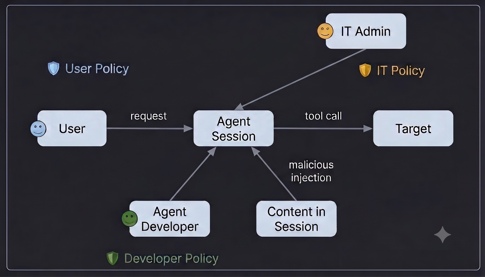

# Policies

Policies are declarative gates that enforce rules on agent behavior. They evaluate agent actions at specific enforcement points and return one of three verdicts:

- **ALLOW** -- the action proceeds.
- **DENY** -- the action is blocked; the agent receives an error.
- **ASK** -- the action is paused for user approval; approved becomes ALLOW, refused becomes DENY.

Policies compose: multiple policies can be active at once. The engine evaluates them in declaration order. A DENY from any policy short-circuits the rest.

## Who configures policies

Policies are set at three levels. Each level serves a different persona:

| Level | Who | How | Evaluated |
|-------|-----|-----|-----------|
| **Server-wide** | Admin | `policies` in server config YAML, or REST API | Last |
| **Agent spec** | Agent developer | `policies` in agent YAML | Middle |
| **Session** | End user | Session settings panel in the UI | First |

Session policies evaluate first and can short-circuit (DENY) before spec or admin policies run.



---

## For server admins

### Setting up server-wide policies

Server-wide (default) policies apply to every session. They act as organizational guardrails.

**1. Choose policies.** Browse the builtin policy registry (see [Builtin policies](#builtin-policies) below) or install community/custom policy modules.

**2. Register custom policy modules** (optional). If you use policies outside the builtins, add their module paths to the server config so they appear in the registry:

```yaml
# server_config.yaml
policy_modules:
  - myorg_policies
  - github_mcp_policy
```

**3. Add policies to the server config.**

```yaml
# server_config.yaml
policies:
  session_budget:
    type: function
    handler: omnigent.policies.builtins.cost.cost_budget
    factory_params:
      max_cost_usd: 10.00
      ask_thresholds_usd: [5.00]
  global_rate_limit:
    type: function
    handler: omnigent.policies.builtins.safety.max_tool_calls_per_session
    factory_params:
      limit: 200
```

**4. Start the server.**

```bash
omnigent server --config server_config.yaml
```

After starting, you can also add or remove policies at runtime through the REST API (see [Admin policy REST API](#admin-policy-rest-api)).

---

## For agent developers

### Adding policies to an agent spec

Policies are declared under `policies` at the top level of the agent YAML. They are evaluated in declaration order.

```yaml
name: github_agent
prompt: You are a coding assistant with access to GitHub.

executor:
  harness: claude-sdk
  model: databricks-claude-sonnet-4-6

tools:
  github:
    type: mcp
    url: https://api.githubcopilot.com/mcp/

policies:
  limit_tool_calls:
    type: function
    handler: omnigent.policies.builtins.safety.max_tool_calls_per_session
    factory_params:
      limit: 100
  github_access:
    type: function
    handler: omnigent.policies.builtins.github.github_policy
    factory_params:
      write_repos:
        - myorg/my-repo
      write_branches:
        - "feature/*"
  google_policy:
    type: function
    handler: omnigent.policies.builtins.google.gdrive_policy
    factory_params:
      read_all: true
      allow_create: true
```

### Policy declaration syntax

Each policy entry has:

| Field | Required | Description |
|-------|----------|-------------|
| `type` | yes | `"function"` |
| `handler` | yes | Dotted Python import path to the callable or factory |
| `factory_params` | no | Key-value arguments passed to a factory at build time |

**Direct callable** (no parameters):

```yaml
approve_file_ops:
  type: function
  handler: omnigent.policies.builtins.safety.ask_on_os_tools
```

**Factory** (with parameters -- called once at build time to produce the evaluator):

```yaml
rate_limit:
  type: function
  handler: omnigent.policies.builtins.safety.max_tool_calls_per_session
  factory_params:
    limit: 50
```

`factory_params` is equivalent to the inline `function: {path, arguments}`
form, so the block above is the same as:

```yaml
rate_limit:
  type: function
  function:
    path: omnigent.policies.builtins.safety.max_tool_calls_per_session
    arguments:
      limit: 50
```

Supply arguments through one of the two — declaring both `factory_params`
and `function.arguments` on the same policy is rejected.

---

## For session users

### Adding policies to a running session

Session-level policies let you customize agent behavior for your current task. There are two ways to add them:

1. **UI** -- Open the information window to browse available policies and toggle them on or off.
2. **Chat** -- Tell the agent directly, e.g. *"add a policy that asks me before running shell commands"*. The agent has a built-in `sys_add_policy` tool and will configure the policy for you.

Session policies evaluate before agent spec and admin policies, so they can enforce stricter rules or add additional gates for your specific workflow.

---

## Builtin policies

### Safety

#### `max_tool_calls_per_session`

Limits the total number of tool calls in a session. DENYs after the limit is reached.

| Parameter | Type | Default | Description |
|-----------|------|---------|-------------|
| `limit` | integer | `100` | Maximum tool calls allowed |

```yaml
rate_limit:
  type: function
  handler: omnigent.policies.builtins.safety.max_tool_calls_per_session
  factory_params:
    limit: 50
```

#### `ask_on_os_tools`

Requires user approval before any `sys_os_read`, `sys_os_write`, `sys_os_edit`, or `sys_os_shell` tool call. No parameters (direct callable).

```yaml
approve_file_ops:
  type: function
  handler: omnigent.policies.builtins.safety.ask_on_os_tools
```

#### `block_skills`

Prevents the agent from loading specific skills.

| Parameter | Type | Default | Description |
|-----------|------|---------|-------------|
| `blocked` | string[] | (required) | Skill names to block (case-insensitive) |

```yaml
no_deploy_skill:
  type: function
  handler: omnigent.policies.builtins.safety.block_skills
  factory_params:
    blocked: [deploy, rollback]
```

#### `enforce_sandbox`

Forces a specific sandbox configuration on agent start.

| Parameter | Type | Default | Description |
|-----------|------|---------|-------------|
| `sandbox_type` | string | `"linux_bwrap"` | Sandbox backend (`linux_bwrap`, `darwin_seatbelt`, `none`) |
| `allow_network` | boolean | `true` | Allow network access |
| `write_paths` | string[] | `null` | Writable paths (null inherits agent config) |
| `read_paths` | string[] | `null` | Read-only paths (null inherits agent config) |
| `env_passthrough` | string[] | `null` | Env vars allowed through to the agent process (see below) |

`env_passthrough` is the escape hatch for an agent that authenticates from an
environment variable. Agent CLIs are spawned with a **deny-by-default**
environment: the shared base (`HOME`, `PATH`, proxy/TLS, locale, `TMPDIR`, the
Omnigent session marker) plus the harness's own variable family, and nothing
else. A host secret belonging to some other provider is not inherited.

That means an ambient key which used to reach the CLI implicitly now has to be
declared. Two cases worth knowing:

- **A generic ACP agent** (`type: acp`) gets no vendor family at all, because
  Omnigent cannot know which vendor an arbitrary agent belongs to. Gemini via
  ACP needs `env_passthrough: ["GEMINI_API_KEY"]`.
- **Goose** owns `GOOSE_*` only. Goose configured through Omnigent's
  provider/gateway routing is unaffected, but a goose set up against an ambient
  provider key (`OPENAI_API_KEY`, `ANTHROPIC_API_KEY`, ...) needs that name
  declared here.

An agent that fails during its `initialize` handshake for no obvious reason is
worth checking against this first; the ACP executor logs a hint pointing back at
this field.

#### `deny_pii_in_llm_request`

Scans user messages and LLM prompts for PII patterns (SSN, credit card, email, phone).

| Parameter | Type | Default | Description |
|-----------|------|---------|-------------|
| `pii_types` | string[] | `["ssn", "credit_card", "email", "phone"]` | PII categories to scan |
| `action` | string | `"DENY"` | Action when PII detected (`DENY` or `ASK`) |

### Cost

#### `cost_budget`

Gates a session on cumulative LLM spend, at the **request** phase (before the LLM turn, so text-only turns are budgeted too) and the **tool-call** phase. ASKs the first time spend crosses each soft warning threshold. At the hard limit it acts as a **downgrade gate**, not a hard stop: it DENYs (the whole turn on `request`, or each tool call on `tool_call`) only while the session is on an expensive model -- telling the user to switch to a cheaper one with `/model` -- and allows them again once the session has switched.

| Parameter | Type | Default | Description |
|-----------|------|---------|-------------|
| `max_cost_usd` | number | (required) | Hard spend limit in USD. Once reached, the turn / tool calls are blocked while the session is on an expensive model. |
| `ask_thresholds_usd` | number[] | `null` | Soft warning checkpoints that ASK the first time spend crosses each (each must be < `max_cost_usd`) |
| `expensive_models` | string[] | Fable + Opus + GPT-5 (excl. `-mini`/`-nano`) | Case-insensitive substring tokens for the model tiers blocked once over budget (e.g. `"opus"` matches any Opus deployment). The default's broad `gpt-5` token matches the whole GPT-5 family except the cheap `-mini`/`-nano` variants; an explicit list is matched literally with no exclusions. `[]` disables the hard limit, leaving only the soft thresholds. |

```yaml
budget:
  type: function
  handler: omnigent.policies.builtins.cost.cost_budget
  factory_params:
    max_cost_usd: 5.00
    ask_thresholds_usd: [1.00, 3.00]
    expensive_models: ["opus", "gpt-5"]
```

#### `user_daily_cost_budget`

Same ASK / downgrade-gate behavior as `cost_budget`, but the budget is the **session owner's cumulative spend across all their sessions for the current UTC day**. The soft-threshold approval is remembered per user+day, so an approved checkpoint won't re-prompt that user again today -- even from a different session. Useful as a server-wide per-user daily cap.

| Parameter | Type | Default | Description |
|-----------|------|---------|-------------|
| `max_cost_usd` | number | (required) | Hard daily limit in USD. Once the owner's spend for the day reaches it, the turn / tool calls are blocked while on an expensive model. |
| `ask_thresholds_usd` | number[] | `null` | Soft daily warning checkpoints that ASK the first time the owner's daily spend crosses each (each must be < `max_cost_usd`) |
| `expensive_models` | string[] | Fable + Opus + GPT-5 (excl. `-mini`/`-nano`) | Case-insensitive substring tokens for the model tiers blocked once over the daily budget. An explicit list is matched literally with no exclusions. `[]` disables the hard limit, leaving only the soft thresholds. |

```yaml
# server_config.yaml -- a per-user daily cap applied to every session
daily_budget:
  type: function
  handler: omnigent.policies.builtins.cost.user_daily_cost_budget
  factory_params:
    max_cost_usd: 25.00
    ask_thresholds_usd: [10.00, 20.00]
```

### GitHub

#### `github_policy`

Controls GitHub access across MCP tools and `git`/`gh` shell commands. Restricts reads to an allowlist (unless `read_all`) and writes to specific repos/branches. Shell commands with ambiguous targets return ASK.

| Parameter | Type | Default | Description |
|-----------|------|---------|-------------|
| `read_all` | boolean | `true` | Allow all reads |
| `read_repos` | string[] | `[]` | Repos readable when `read_all` is false (`owner/repo` or URLs) |
| `write_repos` | string[] | `[]` | Repos the agent may write to |
| `write_branches` | string[] | `[]` | Branches writable within allowed repos (empty = any) |
| `mcp_tool_prefixes` | string[] | `["mcp__github__", "github__"]` | Tool-name prefixes to match |
| `shell_tools` | string[] | `["sys_os_shell"]` | Shell tools whose commands are parsed for git/gh |

```yaml
github_access:
  type: function
  handler: omnigent.policies.builtins.github.github_policy
  factory_params:
    write_repos:
      - myorg/frontend
      - myorg/backend
    write_branches:
      - "feature/*"
      - "fix/*"
```

### Google Workspace

#### `gdrive_policy`

Controls Google Drive / Docs / Sheets / Slides access. Writes are restricted to files the agent created in the current session plus explicitly allowed files.

| Parameter | Type | Default | Description |
|-----------|------|---------|-------------|
| `read_all` | boolean | `true` | Allow all reads |
| `read_files` | string[] | `[]` | File IDs or URLs readable when `read_all` is false |
| `allow_create` | boolean | `false` | Allow creating new files |
| `write_files` | string[] | `[]` | File IDs or URLs always writable |
| `comment_files` | string[] | `[]` | File IDs or URLs the agent may comment on |
| `tool_prefixes` | string[] | `["mcp__google__", "google__"]` | Tool-name prefixes to match |

#### `gmail_policy`

Controls Gmail access. Defaults to read + draft but no send.

| Parameter | Type | Default | Description |
|-----------|------|---------|-------------|
| `allow_read` | boolean | `true` | Allow reading mail |
| `allow_send` | boolean | `false` | Allow sending mail |
| `allow_drafts` | boolean | `true` | Allow creating/editing own drafts |
| `allow_modify` | boolean | `false` | Allow modifying messages (labels, trash) |
| `tool_prefixes` | string[] | `["mcp__google__", "google__"]` | Tool-name prefixes |

#### `gcalendar_policy`

Controls Google Calendar access. Defaults to read-only.

| Parameter | Type | Default | Description |
|-----------|------|---------|-------------|
| `allow_read` | boolean | `true` | Allow reading calendars/events |
| `allow_create_events` | boolean | `false` | Allow creating events |
| `allow_modify_events` | boolean | `false` | Allow updating/deleting events |
| `tool_prefixes` | string[] | `["mcp__google__", "google__"]` | Tool-name prefixes |

### Working directory

#### `block_working_dir_changes`

Blocks shell commands that change the working directory (`cd`, `pushd`, `git -C`) or manage git worktrees. Parses chained and wrapped commands to prevent trivial bypasses.

| Parameter | Type | Default | Description |
|-----------|------|---------|-------------|
| `block_cd` | boolean | `true` | Block cd/chdir/pushd/popd and git -C |
| `block_worktree` | boolean | `true` | Block git worktree add/move/remove |
| `allowed_dirs` | string[] | `[]` | Directories cd may move into (including subdirectories) |
| `action` | string | `"deny"` | Verdict for gated commands (`deny` or `ask`) |
| `shell_tools` | string[] | `["sys_os_shell"]` | Shell tools to parse |

### Risk score

#### `risk_score_policy`

Accrues a per-session risk score from tool calls and sensitive data labels. Escalates guarded tools to ASK or DENY once the score exceeds a threshold.

| Parameter | Type | Default | Description |
|-----------|------|---------|-------------|
| `threshold` | integer | `50` | Score at which guarded tools escalate |
| `tool_points` | object | `{}` | Tool name to points mapping, e.g. `{"web_search": 10}` |
| `sensitive_labels` | object | `{}` | Data-classification label to points, e.g. `{"Highly Confidential": 30}` |
| `guarded_tools` | string[] | `[]` | Tools gated once score reaches threshold |
| `escalate_action` | string | `"ASK"` | Verdict for guarded tools over threshold |
| `initial_scores_by_actor` | object | `{}` | Actor email to starting score offset |
| `state_key` | string | `"risk_score"` | Session state key for the running score |

### Routing

#### `deny_trivial_to_expensive_model`

Classifies user messages as TRIVIAL or COMPLEX using the server LLM. Denies trivial tasks from using expensive models. Requires the server to have an `llm:` config block.

| Parameter | Type | Default | Description |
|-----------|------|---------|-------------|
| `expensive_models` | string[] | (required) | Model IDs to gate, e.g. `["databricks-claude-opus-4-6"]` |
| `classification_prompt` | string | (builtin default) | System instructions for the classifier |

```yaml
# server_config.yaml
llm:
  model: databricks-gpt-5-4-mini

policies:
  deny_trivial_opus:
    type: function
    handler: omnigent.policies.builtins.routing.deny_trivial_to_expensive_model
    factory_params:
      expensive_models:
        - databricks-claude-opus-4-6
```

---

## Writing custom policies

### Policy function interface

A policy function receives an event dict and returns a response dict (or `None` to abstain).

```python
from omnigent.policies.schema import PolicyEvent, PolicyResponse

def my_policy(event: PolicyEvent) -> PolicyResponse | None:
    if event["type"] != "tool_call":
        return None  # abstain on non-tool phases
    tool = event["data"]["name"]
    if tool == "dangerous_tool":
        return {"result": "DENY", "reason": "This tool is blocked."}
    return {"result": "ALLOW"}
```

### Factory form

For policies that need configuration, write a factory -- a function that accepts parameters and returns the actual evaluator:

```python
def block_domains(blocked_domains: list[str]) -> callable:
    blocked = frozenset(d.lower() for d in blocked_domains)

    def evaluate(event: PolicyEvent) -> PolicyResponse | None:
        if event["type"] != "tool_call" or event["target"] != "web_fetch":
            return None
        url = event["data"]["arguments"].get("url", "")
        for domain in blocked:
            if domain in url.lower():
                return {"result": "DENY", "reason": f"Domain {domain} is blocked."}
        return {"result": "ALLOW"}

    return evaluate
```

### Event and response examples

**Event dict** passed to the policy callable (example for a `tool_call` phase):

```json
{
  "type": "tool_call",
  "target": "sys_os_shell",
  "data": {
    "name": "sys_os_shell",
    "arguments": {"command": "rm -rf /tmp/data"}
  },
  "context": {
    "actor": {"run_as": "alice@example.com", "client_id": "oauth_abc"},
    "usage": {
      "input_tokens": 1520,
      "output_tokens": 340,
      "total_tokens": 1860,
      "total_cost_usd": 0.012
    }
  },
  "session_state": {"call_count": 5},
  "request_data": null
}
```

**Response dict** returned by the policy callable:

```json
{
  "result": "DENY",
  "reason": "Destructive shell command blocked.",
  "state_updates": [
    {"key": "call_count", "action": "increment", "value": 1}
  ]
}
```

`result` is the only required field. Valid values: `"ALLOW"`, `"DENY"`, `"ASK"`. Return `None` to abstain.

`state_updates` supports four actions: `"set"`, `"increment"`, `"delete"`, `"append"`.

### Making policies discoverable

To make custom policies appear in the UI, export a `POLICY_REGISTRY` list from your module:

```python
# myorg/policies.py

POLICY_REGISTRY = [
    {
        "handler": "myorg.policies.block_domains",
        "kind": "factory",
        "name": "Block Domains",
        "description": "Block web access to specific domains.",
        "params_schema": {
            "type": "object",
            "properties": {
                "blocked_domains": {
                    "type": "array",
                    "items": {"type": "string"},
                    "description": "Domains to block"
                }
            },
            "required": ["blocked_domains"]
        }
    }
]
```

Then register the module in the server config:

```yaml
policy_modules:
  - myorg.policies
```

---

## Appendix: Admin policy REST API

After starting the server, admins can manage default policies at runtime through these endpoints:

```bash
# Create a server-wide policy
curl -X POST http://localhost:6767/v1/policies \
  -H "Content-Type: application/json" \
  -d '{
    "name": "global_rate_limit",
    "type": "python",
    "handler": "omnigent.policies.builtins.safety.max_tool_calls_per_session",
    "factory_params": {"limit": 200}
  }'
```

| Method | Endpoint | Description |
|--------|----------|-------------|
| `POST` | `/v1/policies` | Create a default policy |
| `GET` | `/v1/policies` | List all default policies |
| `GET` | `/v1/policies/{policy_id}` | Get a specific policy |
| `PATCH` | `/v1/policies/{policy_id}` | Update (name, handler, enabled) |
| `DELETE` | `/v1/policies/{policy_id}` | Remove a policy |

`GET /v1/policy-registry` lists all discoverable policies with parameter schemas -- useful for building admin UIs.
