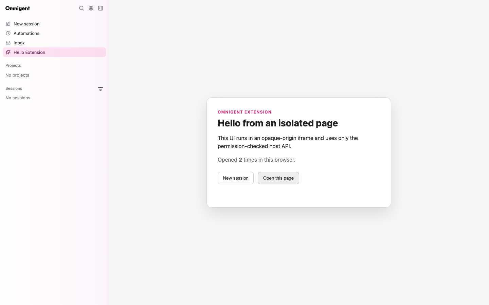

# Extensions

Omnigent extensions are operator-installed Python distributions that contribute
validated application metadata. V1 supports namespaced browser pages and links
in the primary sidebar.

## Trust model

Installing a Python distribution is a full-code-trust operation: Python entry
points execute in the Omnigent server process while their manifests are loaded.
Only administrators should install extension packages.

Browser UI receives a separate boundary. It runs in an opaque-origin sandboxed
iframe, cannot access the parent React tree, cookies, authenticated transport,
or native bridges, and has no network egress. Privileged actions use the
versioned, permission-checked browser SDK.

```text
trusted Python package -> validated manifest -> server catalog
                                                |
                                      sandboxed browser page
                                                |
                                      checked MessageChannel API
```

## V1 contribution points

- `pages`: one-segment routes under `/extensions/{extension_id}/{route}`.
- `primary_navigation`: links rendered in the extension-owned slot between
  Inbox and Usage. `order` sorts only within that slot.

Command metadata, activation events, and `when` expressions are validated and
reserved but are not executed or evaluated in V1. Arbitrary React components,
DOM selectors, FastAPI routers, runner tools, and user-installed marketplace
packages are not supported.

## Installation and diagnostics

Declare an `omnigent.extensions` entry point, install the wheel in the server's
Python environment, and restart the server. Installation implies enablement for
V1; there is no separate enable switch.

```bash
omni extensions list
omni extensions doctor publisher.extension
```

A broken extension does not stop healthy extensions or the server. Public
catalog entries omit rejected extensions. Administrators can inspect concise
load and asset errors through `doctor` or `/v1/extensions/diagnostics`.



See [Extension manifest](extension_manifest.md),
[Browser extensions](browser_extensions.md), and the
[Hello Page example](../../examples/extensions/hello-page/README.md).
